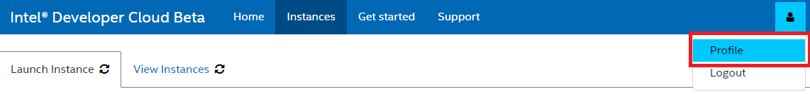
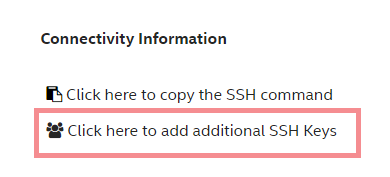

# Intel® Developer Cloud (IDC) TDX & Amber Preview

**WARNING**: This document is for customers who use a system with kernel version 6.2.16 and Intel® Trust Authority GA instances.

## 1. Customer On-Board Intel® Developer Cloud (Beta)

### 1.1 Registration

1. [Sign up](https://www.intel.com/content/www/us/en/developer/tools/devcloud/prelaunch-services.html) for an Intel® Unified Login account with your corporate email address (if not already signed up).
2. [Signin](https://www.intel.com/content/www/us/en/developer/tools/devcloud/prelaunch-services.html) at the Intel® Developer Cloud Beta.


### 1.2 Setup - SSH Keys

Setting up SSH Keys is an one time task.

**WARNING**: Never share your private keys with anyone. Never create a SSH Private key without a passphrase.

1. Launch a Terminal/Command Prompt on your local system.
2. Copy & Paste the following to your terminal/command prompt to generate SSH Keys.

   - Linux*/macOS*:
   ```
   ssh-keygen -t ed25519 -f ~/.ssh/id_rsa
   ```
   - Windows*:
   ```
   mkdir %USERPROFILE%\.ssh
   ssh-keygen -t ed25519 -f %USERPROFILE%\.ssh\id_rsa
   ```

3. If you are prompted to overwrite, select no to use the existing keys
4. Copy & Paste the following to your terminal/command prompt to open your public key.

   - Linux*/macOS*:
   ```
   vi ~/.ssh/id_rsa.pub
   ```
   - Windows*:
   ```
   notepad %USERPROFILE%\.ssh\id_rsa.pub
   ```

    _Note: The public key must be in your Intel® Developer Cloud profile before starting an instance. The instance will need to be relaunched if the public key was updated after a virtual machine is launched._

5. Copy the entire content of the file id_rsa.pub
6. Click Profile Icon from the top blue navigation bar and click Profile. You must login to [Intel® Developer Cloud Management Console](https://scheduler.cloud.intel.com/) to see Profile Icon.


7. Paste the copied content in the text box **SSH RSA 4096 Public Key** and Click **Save Key**

    **Note**: If your key is not in default path/name, you must add IdentityFile parameter in SSH config file.

### 1.3 Request Access to TDX Bare Metal Instance
Once the SSH keys are created and the public key uploaded, proceed to request access to the TDX System.
TDX Systems are available upon request only so follow the instructions below to request one.
1. Go to [https://scheduler.cloud.intel.com](https://scheduler.cloud.intel.com) and Sign In (if not already)
2. Click Instances from top blue navigation bar
3. Click on check box for "Beta - Intel® Trust Domain Extensions (Intel® TDX) with 4th Generation Intel® Xeon® Scalable processors"
4. Click on the "Launch Instance" blue button at the bottom of the list
5. Review the details and Click 'Request Instance'
6. Complete the "Request Instance" form and click the "Request Instance" button at the bottom right to submit.
7. If your request is approved, Intel® Developer Cloud Customer Response Team will respond within 2-3 business days.

    

### 1.4 Reserve & Launch the TDX system
After receiving the approval email follow these below steps to launch the TDX System.
1. Go to [https://scheduler.cloud.intel.com](https://scheduler.cloud.intel.com) and Sign In (if not already)
2. Click Instances from top blue navigation bar
3. Click on check box for "Beta - Intel® Trust Domain Extensions (Intel® TDX) with 4th Generation Intel® Xeon® Scalable processors"
4. Click on the "Launch Instance" blue button at the bottom of the list
5. Review the agreement, and if you agree, select the "I agree" checkbox, then click "Launch Instance"
   

7. Please wait (2 minutes) for the instance to be provisioned and launched.
8. On successful launch, you will be redirected to "View Instances" tab as shown below.
   

   **Note**: Only your current public key will be authorized to access this instance.
   **Note**: If you have multiple keys to be authorized to access your reserved instances, or you have changed your public key in profile, you need add those keys in each reserved instance separately.

### 1.5 Access a Bare Metal Instance

**WARNING:** All reserved TDX Systems will be terminated after 7 days.

_NOTE: You will get a bare metal instance where more than one VMs can be created._

1. To access a launched TDX System Instance, from 'View Instances', Click on 'Click here to copy the SSH command' and paste in your terminal or command prompt.

   


   **Note**: If you are connecting to TDX System from your company Corporate Network (behind a proxy), you will need to follow the section [Access from Corporate Network (optional)](#17-access-from-corporate-network-optional) below.

2. User will be shown a password and prompted to enter the password. Enter the shown password.
   
4. After entering the password, you will be logged into the launched TDX System.
5. If you have multiple keys to be authorized to access your reserved instances, you can add those additional keys by following the next step without relaunching instance.
6. In View Instances, on a launched instance, Click on Click here to add additional SSH Keys, to add your additional SSH keys.



12. If you have changed your public key in profile after you launched an instance, you can add your new key by following the next step without relaunching instance.
13. In View Instances, on a launched instance, Click on Click here to add additional SSH Keys, to add your additional SSH keys.


   **Note** To upload a file to TDX system, open a new terminal on your local system and use the following cmd.
   ```
   scp -P 10022 [LOCAL_FILE_NAME] devcloud@localhost:[PATH_TO_DESTINATION]
   ```
   To copy the same file in to TDVM use the following cmd from the TDX system
   ```
   scp [LOCAL_FILE_NAME] devcloud@[TDVM_IP_ADDRESS]:[PATH_TO_DESTINATION]
   ```

   **Note** To download a file from TDX system, open a new terminal on your local system and use the follwoing cmd.
   ```
   scp -P 10022 devcloud@localhost:[PATH_TO_REMOTE_FILE]  .
   ```

### 1.6 Help/Support Resources


### 1.7 Access from Corporate Network (optional)
   **WARNING**: If you are connecting (SSH) to TDX system from your company's Corporate Network (dehid a proxy), you will need to update SSH config file.

   **Note**: If you connect using Command Prompt on Microsoft* Windows* Operating System, you must install [gitforwindows](https://gitforwindows.org/).

1. Setting up SSH Configuration is an one time task.
2. Your SSH configuration file is located in a folder named .ssh under your user's home folder. If the file is not present, create one.
3. Copy & Paste the following to SSH config file (~/.ssh/config).

   - Linux*/macOS*:
   ```
   Host 146.152.*.* idcbetabatch.eglb.intel.com
   ProxyCommand /usr/bin/nc -x PROXYSERVER:PROXYSPORT %h %p
   ```
   - Windows*:
   ```
   Host 146.152.*.* idcbetabatch.eglb.intel.com
   ProxyCommand "C:\Program Files\Git\mingw64\bin\connect.exe" -S PROXYSERVER:PROXYSPORT %h %p 
   ```

4. From your Lab Administrator, get PROXYSERVER and PROXYPORT in your Corporate Network for SSH, NOT for HTTP/HTTPS Proxy.
5. Replace PROXYSERVER and PROXYPORT with the information you received from your lab administrator and save the SSH Config file.
6. Go back to section [Access a Bare Metal Instance](#15-access-a-bare-metal-instance)


## 2 Intel® Project Amber info
You will also receive another email with subject "Intel® Trust Domain Extensions and Project Amber in Intel® DevCloud". The email will contain the Amber API key and Amber URL that you will need for attestation.

## 3 Use TDX VM
### 3.1 Initial setup

Once logged into the TDX-enabled system, clone the GitHub project and execute the initialization scripts.

```
git clone https://github.com/IntelConfidentialComputing/tdx-amber-idc-preview
cd tdx-amber-idc-preview/scripts
./init.sh
```

### 3.2 Create TD


- Create a TD guest image from official Ubuntu 22.04 image as follows:
```
./create-guest-image.sh -o <image file name> -u <username> -p <password> -n <guest vm name> -s <image size in GB>
```
Example
```
./create-guest-image.sh -o tdx-guest.qcow2 -u tdx -p 123TdVMTest -n my-guest -s 30
```

- Start TD via libvirt

After creating the guest image, use the following command to create a TD.
```
./start-virt.sh -i <image file name> -n <guest vm name> -c <vCPU number> -m <memory size in GB>
```
For example:
```
./start-virt.sh -i tdx-guest.qcow2 -n my-guest -c 4 -m 16
```

_NOTE: You can start more than one TD with different guest vm names._

- You can manage the TDVM using virsh commands as below (optional)
```
# Examples of commands to manage VMs (should be run on the host)
# To exit a running TVDM console session, use ^] (i.e. hit Ctrl+] keys)

# list all VMs created by current Linux account
virsh list --all

# Suspend a VM
virsh suspend my-guest

# Resume a VM
virsh resume my-guest

# Shutdown a VM
virsh shutdown my-guest

# To start a VM
virsh start my-guest

# To connect to the VM Console
virsh console my-guest

# You can also ssh to the VM via its IP address. Run below command to get IP of the VM. Replace <DOMAIN_ID> with your TD's domain ID.
virsh net-dhcp-leases default | grep `virsh domiflist <DOMAIN_ID> | grep virbr0 | awk '{print $5}'` | awk '{print $5}' | cut -d '/' -f 1
```
_NOTE: You can use tmux to avoid process being terminated after ssh session is disconnected. Please refer to [tmux](https://github.com/tmux/tmux/wiki)._

_NOTE: please change `my-guest` to your guest's name._

_NOTE: Please check chapter 3.2 at the [Whitepaper: Linux* Stacks for Intel® Trust Domain Extension 1.0 v0.11](https://www.intel.com/content/www/us/en/content-details/787041/whitepaper-linux-stacks-for-intel-trust-domain-extension-1-0.html)_

### 3.3 Check Trusted Execution Environment (TEE) environment

1. Check TD Report

`TDREPORT` is a fixed-size data structure generated by the TDX module which contains guest-specific information (such as build and boot measurements), platform security version, and the MAC to protect the integrity of the `TDREPORT`. For more details on `TDREPORT` please refer to section 4.2 in the [Whitepaper: Linux* Stacks for Intel® Trust Domain Extension 1.0 v0.11](https://www.intel.com/content/www/us/en/content-details/787041/whitepaper-linux-stacks-for-intel-trust-domain-extension-1-0.html).


- To generate the td report run the following command
```
tdx@tdx-guest:~$ sudo tdx_tdreport
```

### 3.4 Attestation
Execute the following commands to perform the attestation using [trustauthority-client](https://github.com/intel/trustauthority-client). For more details of trustauthority-cli usage, please refer to [Intel® Trust Authority TDX CLI](https://github.com/intel/trustauthority-client/blob/main/tdx-cli/README.md).

_NOTE: trustauthority-cli has been installed in TD guest image by default. You can use it directly._

- To create RSA keypair.
```
tdx@tdx-guest:~$ sudo trustauthority-cli create-key-pair --pub-path <public key file path>
```

- To get TD Quote.
```
tdx@tdx-guest:~$ sudo trustauthority-cli quote
```

- To get Intel Trust Authority signed token.

`token` command requires Intel Trust Authority configuration to be passed in json format. Save below data in config.json file.
```
{
    "trustauthority_api_url": "<trustauthority attestation api url>",
    "trustauthority_api_key": "<trustauthority attestation api key>",
    "trustauthority_url": "<trustauthority url>"
}
```
Invoke `token` command.
```
tdx@tdx-guest:~$ sudo trustauthority-cli token --config config.json --user-data <base64 encoded userdata> --policy-ids <comma separated trustauthority attestation policy ids>
```
OR
```
tdx@tdx-guest:~$ sudo trustauthority-cli token --config config.json --pub-path <public key file path> --policy-ids <comma separated trustauthority attestation policy ids>
```
_NOTE: The first line of response `Trace Id` like `Trace Id: <TraceID>`. The token is from the second line to the end of the response. Please copy the token as input of the next step._

- To verify Intel Trust Authority signed token. Use the token returned in the above command. 
```
tdx@tdx-guest:~$ sudo trustauthority-cli verify --config config.json --token <attestation token in JWT format>
```

## 4. Run workload without attestation in TD
Running workloads in a TD is exactly the same as you would run the workload in a non-confidential VM.

### Run nginx in TD
```
tdx@tdx-guest:~$ sudo docker run -it --rm -d -p 8080:80 --name web nginx
tdx@tdx-guest:~$ curl http://localhost:8080
```

## 5. Run AI workload accelerated by AMX in TD

Intel® AMX is a new built-in accelerator that improves the performance of deeplearning training and inference on the CPU. AI workload boosted by Intel AMX can run in a TD. To demonstrate AMX capability in TDF, here come 2 examples of AI workload running in TD.

### Prerequisite

 - Create TD guest image with docker images for AI workload.
 ```
 ./create-guest-image.sh -o <image file name> -u <username> -p <password> -n <guest vm name> -s <image file size in GB> -a
 ```
 For example:
 ```
 ./create-guest-image.sh -o tdx-guest-ai.qcow2 -u tdx -p 123TdVMTest -n ai-guest -s 40 -a
 ```

 - Create TD using above guest image. It's recommended to alloacte at least 8vCPU and 32GB memory to the TD for AI workload.
```
./start-virt.sh -i <image file name> -n <guest vm name> -c 8 -m 32
```
For example:
```
./start-virt.sh -i tdx-guest-ai.qcow2 -n ai-guest -c 8 -m 32
```

### Run AI workload accelerated by AMX

Intel® Optimization for TensorFlow, a pre-trained model of mobilenet_v1 and the benchmark tool have been integrated in TD guest image by default. In this example, you can use below commands to run the benchmark with or without AMX. The output will demonstrate AMX acceleration effect.

- Connect to the TD created in prerequisite, run below commands.
```
tdx@tdx-guest:~$ sudo su
root@tdx-guest:~# cd /root/example_ai_workload
```
- Run AI workload with AMX enabled. The output will show "Average Throughput: `<image number>` images/s".
```
root@tdx-guest:~# ./run_ai_workload.sh
```
- Run AI workload with AMX disabled. The output will show "Average Throughput: `<image number>` images/s".
```
root@tdx-guest:~# ./run_ai_workload.sh -d
```

AMX acceleration effect is demonstrated by comparing average throughput of AMX-enabled and AMX-disabled.

### Run Cloud Native AI Pipeline (CNAP)

Cloud native AI pipeline (CNAP) is a multiple-stream and real-time inference pipeline. It provides several microservices to receive input streams, queue the streams in Redis and run inference of the frames. It's a AI workload designed and implemented to fit cloud native model. It's also accelerated by AMX. Please see more details in [Cloud Native AI Pipeline (CNAP)](https://github.com/intel/cloud-native-ai-pipeline).

In this example, you can use below commands to run the CNAP workload in containers and check AMX acceleration effect.

_NOTE: To get a better performance data, it's recommended to set cpu mode to performance on the host. Please refer to below command._

- (Optional) Set CPU mode to performance on the host.
```
sudo cpupower frequency-set --governor performance
```

- Connect to the TD, run below commands.
```
tdx@tdx-guest:~$ sudo su
root@tdx-guest:~# cd /root/example_cnap
```
- Run CNAP workload. There will be 2 inference containers running, one for AMX-enabled and the other for AMX-disabled.
```
root@tdx-guest:~# ./run_cnap_docker.sh
```

- Check inference FPS of AMX-enabled container.
```
root@tdx-guest:~# docker container logs cnap-inference-amx 2>&1 | grep infer_fps | tail -n 1 | awk '{print $5, $6}'
```

- Check inference FPS of AMX-disabled container.
```
root@tdx-guest:~# docker container logs cnap-inference-non 2>&1 | grep infer_fps | tail -n 1 | awk '{print $5, $6}'
```
AMX acceleration effect is demonstrated by comparing FPS of AMX-enabled and AMX-disabled.

## 5. Further Reading

- [Intel® TDX Whitepaper](https://www.intel.com/content/www/us/en/developer/articles/technical/intel-trust-domain-extensions.html)
- [Amber Introduction](https://projectamber.intel.com/)
- [Intel® Trust Authority](https://docs.trustauthority.intel.com/main/index.html)
- [Whitepaper: Linux* Stacks for Intel® Trust Domain Extension 1.0](https://www.intel.com/content/www/us/en/content-details/787041/whitepaper-linux-stacks-for-intel-trust-domain-extension-1-0.html)
- [Confidential Cloud Native Primitives (CCNP)](https://github.com/intel/confidential-cloud-native-primitives)
- [Cloud Native AI Pipeline (CNAP)](https://github.com/intel/cloud-native-ai-pipeline)

## 6. FAQ

- How to move data in and out of TDVM from local system?

   A: There are 2 approaches moving a file in or out of TDVM.

   Approach 1: Use 'scp' command to copy files between two Linux systems. Run below commands on local system.

   ```
   Copy a file out of TD to local system. 
   $ scp <username>@<TD IP>:<path of file> <local system path to save the file>

   Copy a file in TD from local system. 
   $ scp <local system file> <username>@<TD IP>:<destination path> 
   ```

   Approach 2: Use 'virt-copy-in' or 'virt-copy-out' command. In this case, TD need to be terminated firstly.
   Run below commands on local system. Please refer to [virt-copy-in manual](https://linux.die.net/man/1/virt-copy-in) and [virt-copy-out manual](https://linux.die.net/man/1/virt-copy-out).

   ```
   $ sudo apt-get install libguestfs-tools

   Copy a file out of TD to local system. 
   $ sudo virt-copy-out -a <TD guest image> <file path in TD> <destination path on local system>

   Copy a file in TD from local system. 
   $ sudo virt-copy-in -a <TD guest image> <file path on local host> <destination path in TD>
   ```

- How to access TD ports via the host?

   A: If a workload is running in TD with a specific port, the port is not visible on host by default.
   You may want to forward a host port to the guest so that it can be accessed outside of the TD. 
   
   Add below commands to `scripts/start-qemu.sh` and run `start-qemu.sh` to start a TD. 

   ```
   -net user,hostfwd=tcp::<host port1>-:<TD port1>,hostfwd=tcp::<host port2>-:<TD port2>
   ```

   Then you can access the workload using host port. For example, a nginx web server is running in TD with port 8080. If host port 9090 is forwarded to TD port 8080 using `-net user,hostfwd=tcp::9090-:8080` when TD boots, you can access nginx on the host via command `curl http://localhost:9090`.